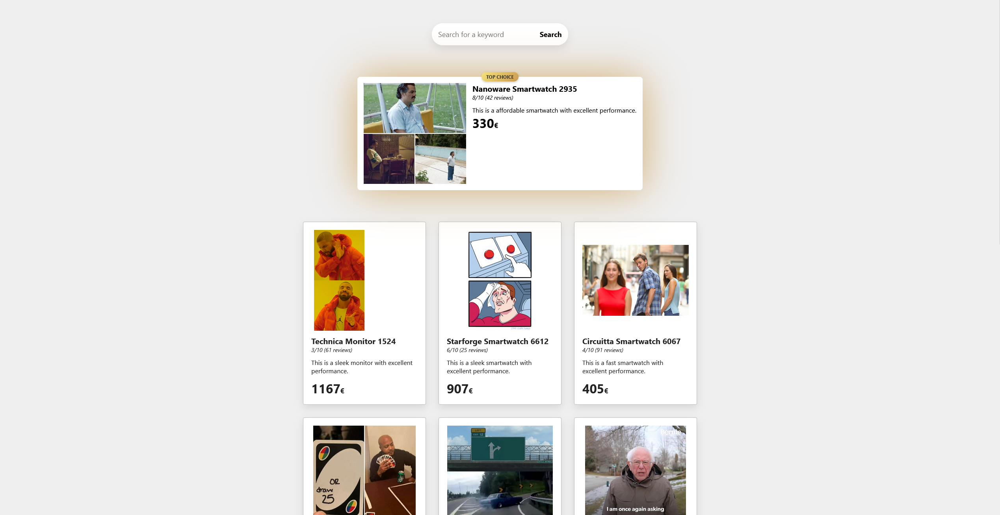

# 🛍️ not-so-boring-webshop-ui

A modern and playful webshop frontend built using vanilla HTML, CSS, and JavaScript. This UI fetches meme data from an external API and displays it as products, complete with search functionality and pagination. Designed as part of a frontend mentoring application task.

## ✨ Features

- ✅ Search bar with live filtering
- ✅ Pagination controls with dynamic state
- ✅ Responsive grid layout for products
- ✅ Top product highlight with special styling
- ✅ Meme API integration for mock product data

## 📦 Technologies Used

- HTML5
- CSS3 (custom + Normalize.css)
- Vanilla JavaScript (no frameworks)
- [Imgflip API](https://api.imgflip.com/get_memes) for product data

## 🖼️ Preview



## 🚀 How to Use

1. Clone the repository:
   ```bash
   git clone https://github.com/adiiwill/not-so-boring-webshop-ui.git
   cd not-so-boring-webshop-ui
   ```
2. Open `index.html` in your browser:
   ```bash
   open index.html
   ```

## 💡 Inspiration

Originally built as part of a frontend task for a mentoring program. While I couldn't submit it in time due to a missing link, I wanted to publish it to share my frontend skills with others.

## 📫 Contact

Made with ❤️ by Ádám Gazdag
Feel free to reach out: LinkedIn | GitHub

---

Let me know if you’d like:
- a Hungarian version
- a short tagline for social sharing

Or anything else to polish it!
